# Exercises 2: Single Table Queries

### Question 1
select * from goal;
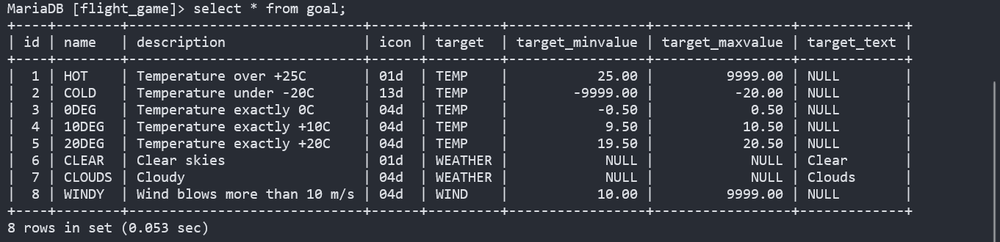

### Question 2
select name, type from airport where iso_country = "FI";
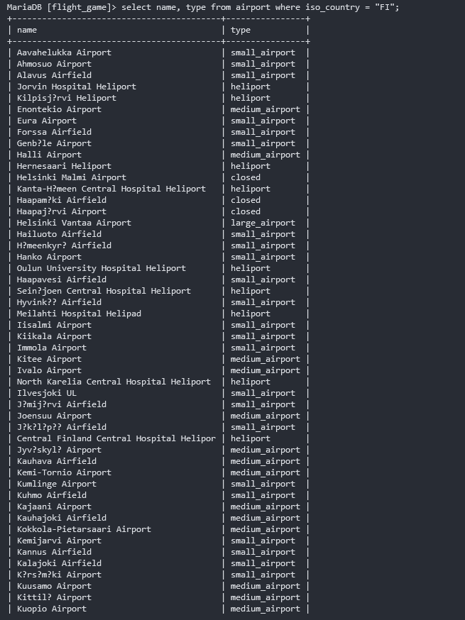

### Question 3
select name from airport where iso_country = "FI" order by name;
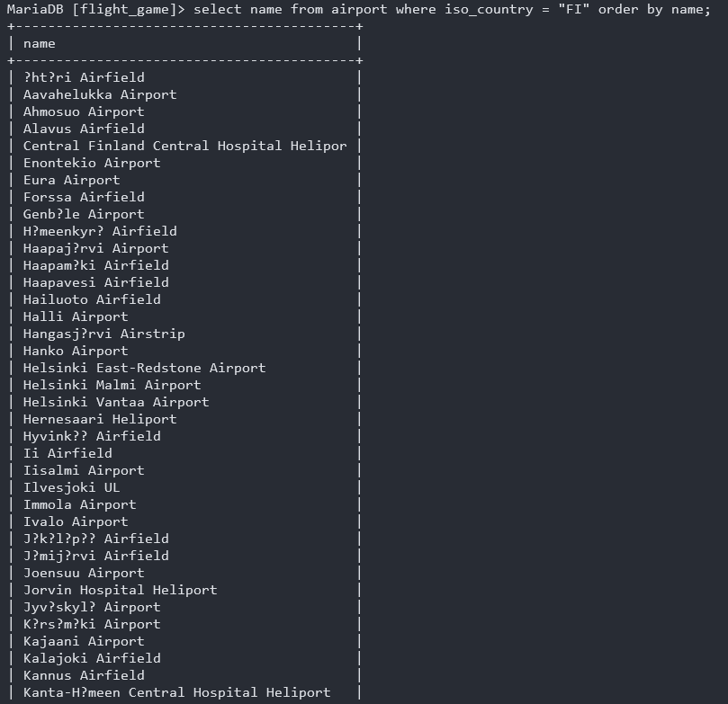

### Question 4
select name, type from airport where iso_country = "FI" order by type, name;
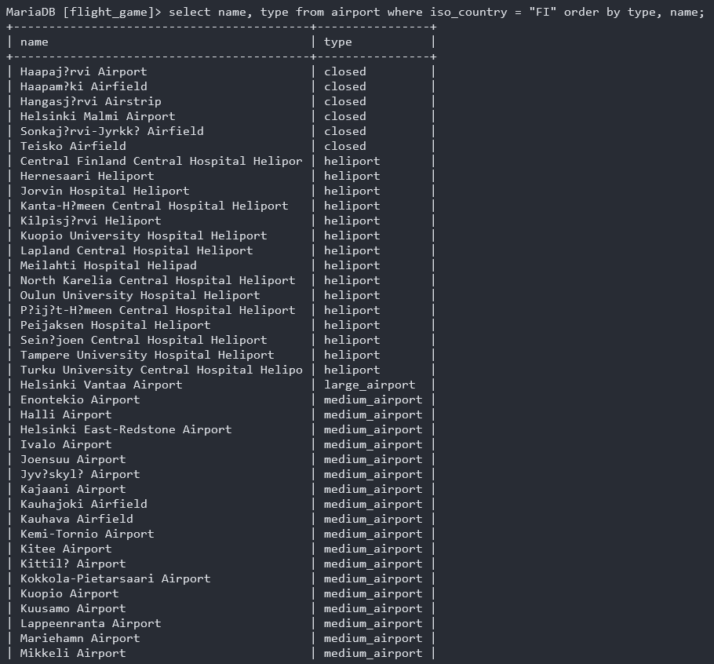

### Question 5
select name from country where name like "F%";
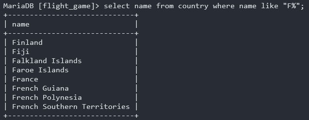

### Question 6
select name from country where name like "%f%";
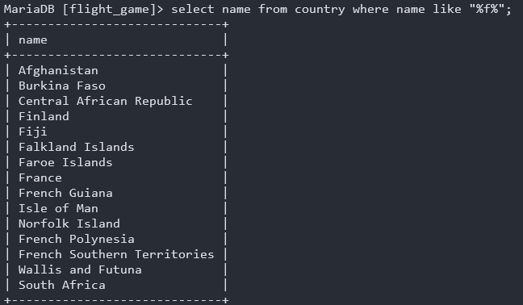

### Question 7
select location from game where screen_name = "Vesa";
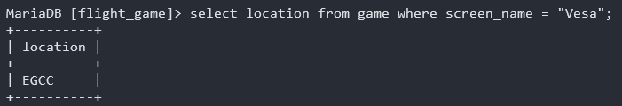

### Question 8
select co2_consumed from game where screen_name = "Ilkka";
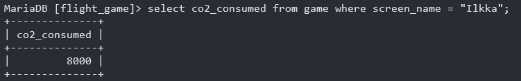

### Question 9
select co2_budget from game where id = "1";
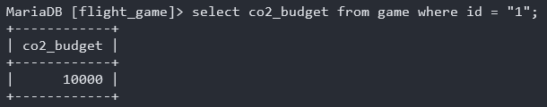

### Question 10
select screen_name, co2_budget, co2_consumed, @co2_left :=co2_budget - co2_consumed as co2_left from game where screen_name = "Ilkka";
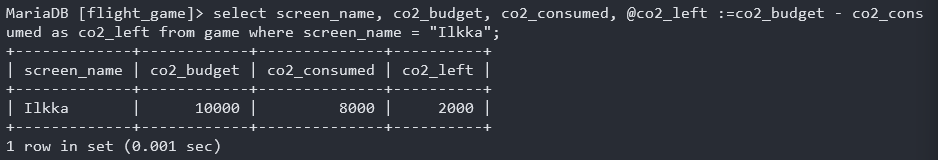

# Exercises 3: Multiple Table Queries

### Question 1
SELECT country.name AS "country name", airport.name AS "airport name" FROM airport, country 
WHERE airport.iso_country = country.iso_country AND country.name = "Iceland";
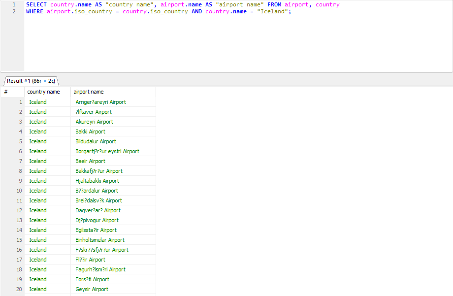

### Question 2
SELECT NAME AS "airport name" FROM airport WHERE iso_country = "FR" AND TYPE = "large_airport";
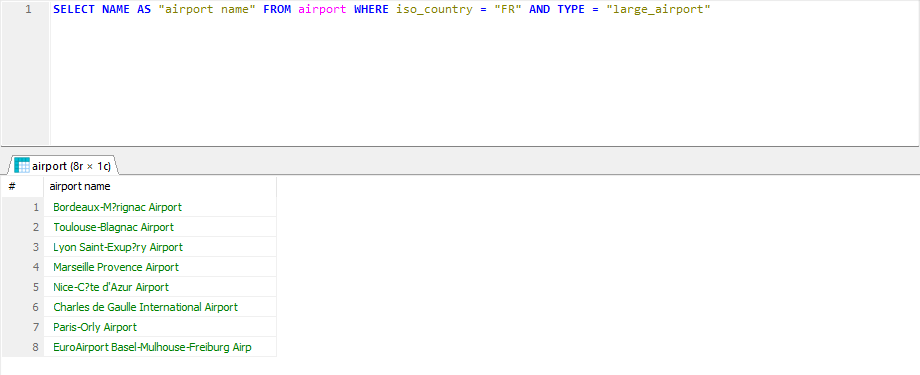

### Question 3
SELECT country.name AS "country_name", airport.name AS "airport_name" FROM airport, country WHERE country.iso_country = airport.iso_country and airport.continent = "AN";
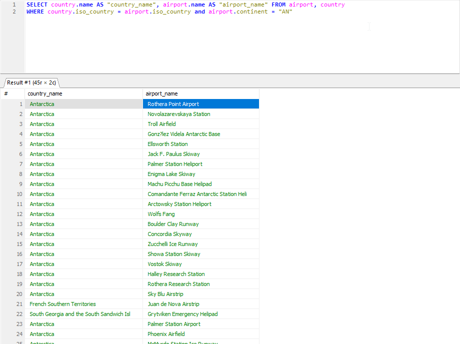

### Question 4
SELECT elevation_ft FROM airport, game WHERE game.location = airport.ident AND game.screen_name = "Heini";
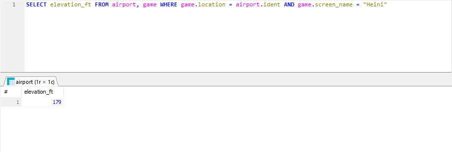

### Question 5
SELECT elevation_ft * 0.3048 AS "elevation_m" FROM airport, game 
WHERE game.location = airport.ident AND game.screen_name = "Heini";
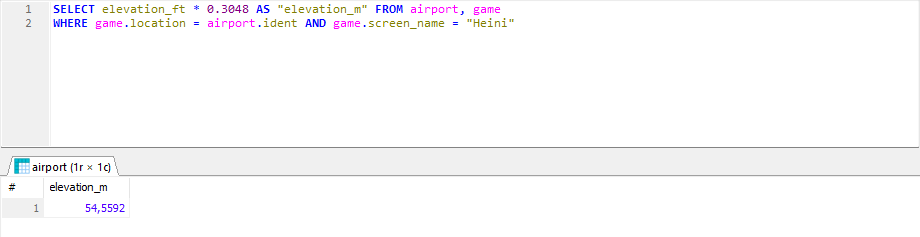

### Question 6
SELECT elevation_ft * 0.3048 AS "elevation_m" FROM airport, game 
WHERE game.location = airport.ident AND game.screen_name = "Heini";
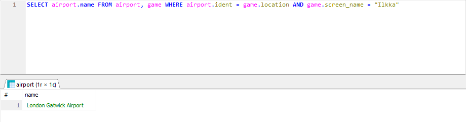

### Question 7
SELECT country.name FROM country, game, airport 
WHERE airport.ident = game.location AND airport.iso_country = country.iso_country AND game.screen_name = "Ilkka";
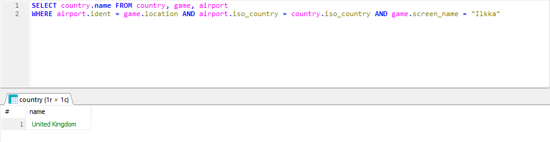

### Question 8
SELECT goal.name FROM game, goal, goal_reached 
WHERE game.id = goal_reached.game_id AND goal.id = goal_reached.goal_id AND game.screen_name = "Heini";
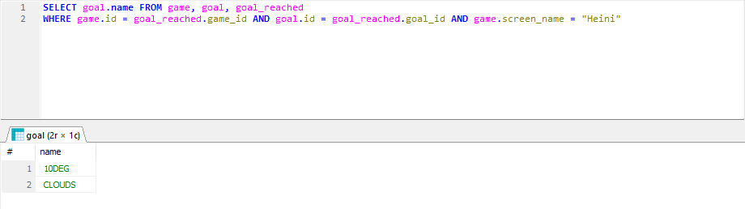

### Question 9
SELECT airport.name 
FROM airport, game, goal, goal_reached 
WHERE airport.ident = game.location AND goal_reached.game_id = game.id 
AND goal_reached.goal_id = goal.id AND game.screen_name = "Ilkka";
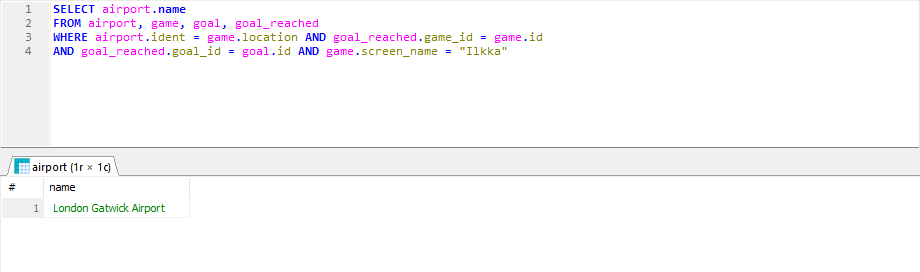

### Question 10
SELECT country.name 
FROM airport, country, game, goal, goal_reached 
WHERE airport.ident = game.location AND country.iso_country = airport.iso_country AND goal_reached.game_id = game.id 
AND goal_reached.goal_id = goal.id AND game.screen_name = "Ilkka";
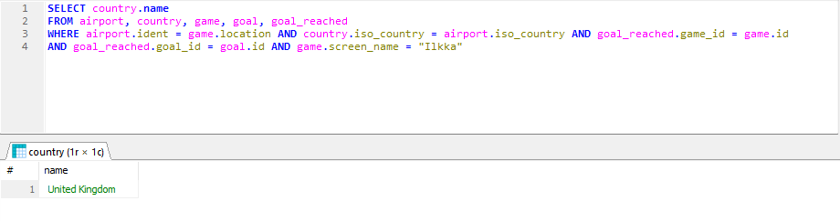
