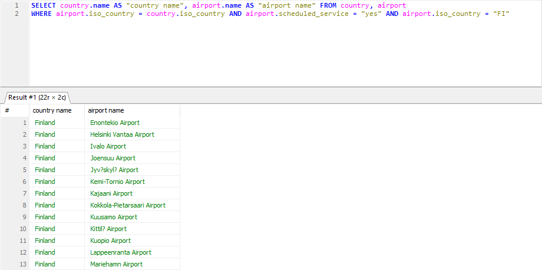
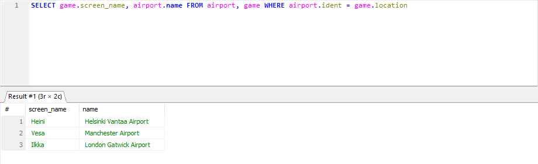
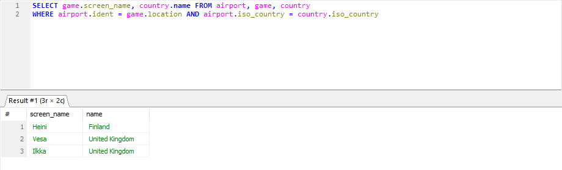
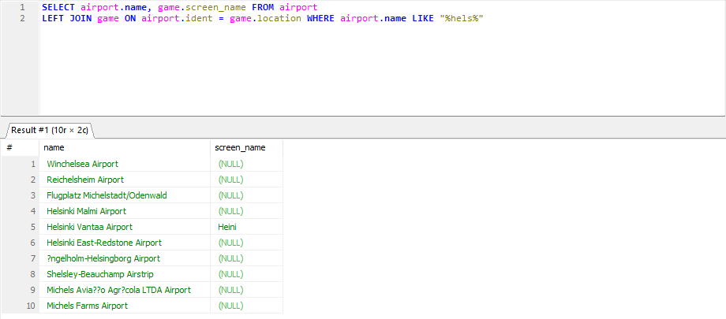
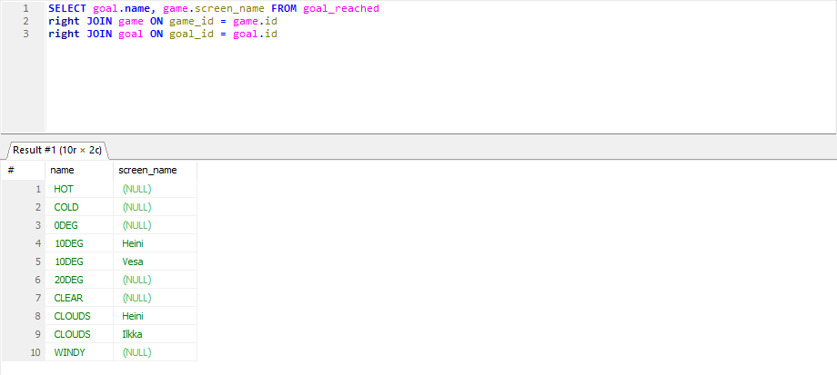
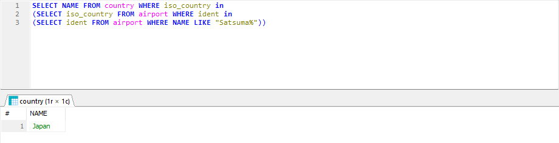
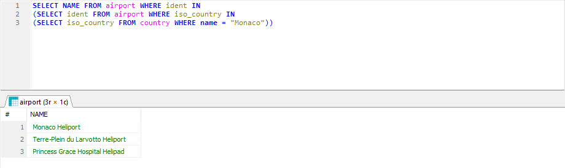
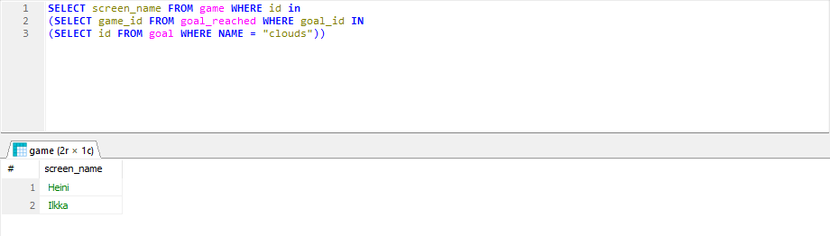
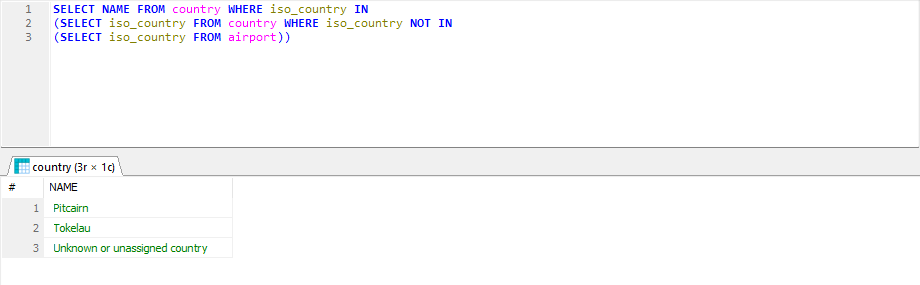
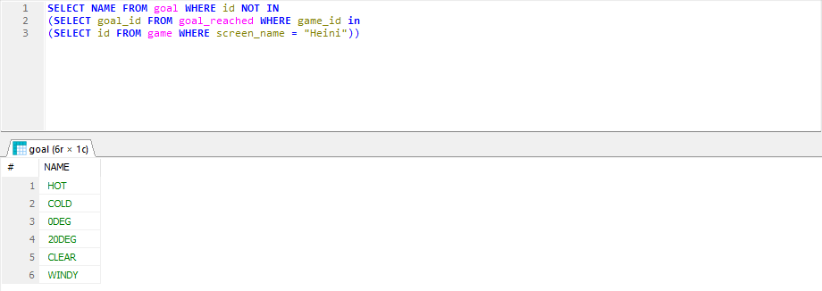

# Exercises 4: Join

### Question 1
SELECT country.name AS "country name", airport.name AS "airport name" FROM country, airport
WHERE airport.iso_country = country.iso_country AND airport.scheduled_service = "yes" AND airport.iso_country = "FI";

### Question 2
SELECT game.screen_name, airport.name FROM airport, game WHERE airport.ident = game.location;

### Question 3
SELECT game.screen_name, country.name FROM airport, game, country 
WHERE airport.ident = game.location AND airport.iso_country = country.iso_country;

### Question 4
SELECT airport.name, game.screen_name FROM airport 
LEFT JOIN game ON airport.ident = game.location WHERE airport.name LIKE "%hels%";

### Question 5
SELECT goal.name, game.screen_name FROM goal_reached
right JOIN game ON game_id = game.id
right JOIN goal ON goal_id = goal.id;

# Exercises 5: Subqueries

### Question 1
SELECT NAME FROM country WHERE iso_country in
(SELECT iso_country FROM airport WHERE ident in
(SELECT ident FROM airport WHERE NAME LIKE "Satsuma%"));

### Question 2
SELECT NAME FROM airport WHERE ident IN
(SELECT ident FROM airport WHERE iso_country IN
(SELECT iso_country FROM country WHERE name = "Monaco"));

### Question 3
SELECT screen_name FROM game WHERE id in
(SELECT game_id FROM goal_reached WHERE goal_id IN
(SELECT id FROM goal WHERE NAME = "clouds"));

### Question 4
SELECT NAME FROM country WHERE iso_country IN
(SELECT iso_country FROM country WHERE iso_country NOT IN
(SELECT iso_country FROM airport));

### Question 5
SELECT NAME FROM goal WHERE id NOT IN 
(SELECT goal_id FROM goal_reached WHERE game_id IN 
(SELECT id FROM game WHERE screen_name = "Heini"));
