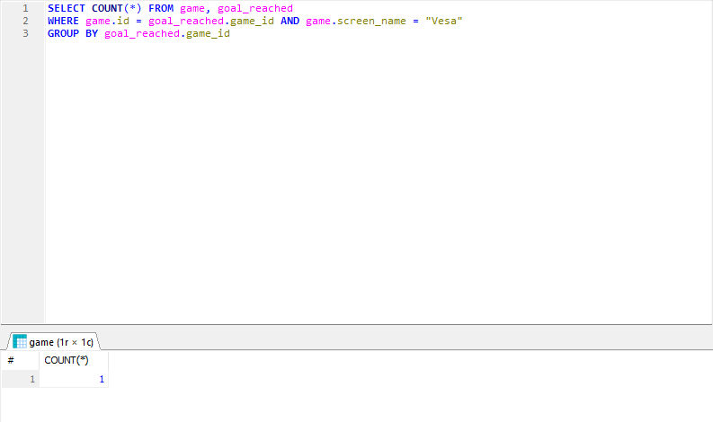
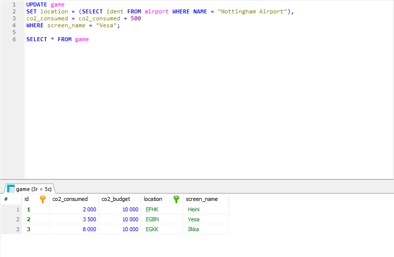

# Exercises 6: Aggregate Queries

### Question 1
SELECT max(elevation_ft) FROM airport;

### Question 2
SELECT continent, COUNT(*) FROM country
GROUP BY continent;

### Question 3
SELECT screen_name, COUNT(*) FROM game, goal_reached WHERE game.id = game_id
GROUP BY game_id;

### Question 4
select screen_name from game where id IN 
(SELECT id FROM game WHERE co2_consumed IN (SELECT MIN(co2_consumed) FROM game));

### Question 5
SELECT country.name, COUNT(*) FROM airport, country 
WHERE airport.iso_country = country.iso_country GROUP BY country.iso_country
ORDER BY COUNT(*) DESC LIMIT 50;

### Question 6
SELECT country.name FROM country, airport WHERE airport.iso_country = country.iso_country 
GROUP BY airport.iso_country HAVING COUNT(*) > 1000;

### Question 7
SELECT NAME FROM airport WHERE elevation_ft IN (SELECT MAX(elevation_ft) FROM airport);

### Question 8
SELECT country.name FROM country, airport WHERE country.iso_country = airport.iso_country 
AND elevation_ft IN (SELECT MAX(elevation_ft) FROM airport);

### Question 9
SELECT COUNT(*) FROM game, goal_reached 
WHERE game.id = goal_reached.game_id AND game.screen_name = "Vesa" 
GROUP BY goal_reached.game_id;

### Question 10
SELECT NAME FROM airport WHERE latitude_deg IN (SELECT MIN(latitude_deg) FROM airport);

# Exercises 7: Update Queries

### Question 1
UPDATE game
SET location = (SELECT ident FROM airport WHERE NAME = "Nottingham Airport"), 
co2_consumed = co2_consumed + 500
WHERE screen_name = "Vesa";

SELECT * FROM game;

### Question 2
a. goal_reached;

### Question 3
DELETE FROM goal_reached;
SELECT * FROM goal_reached;

### Question 4
DELETE FROM game;
SELECT * FROM game;
